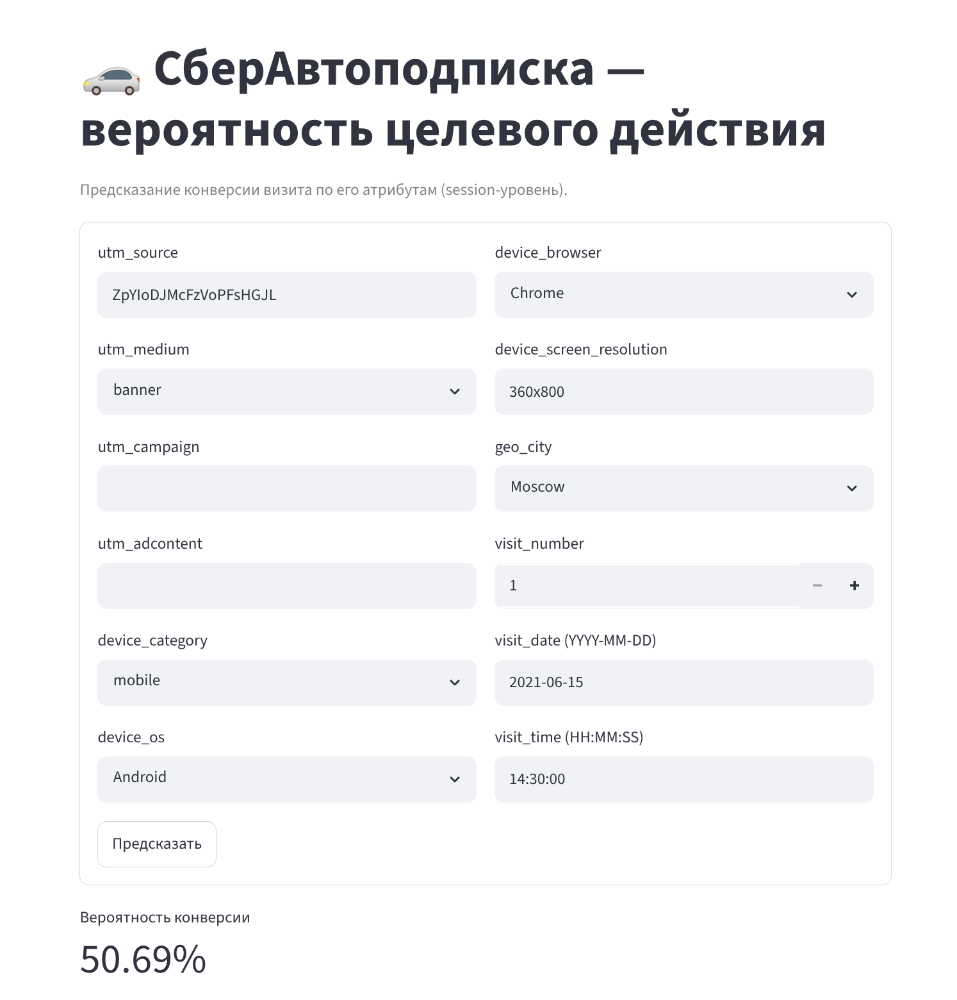

# СберАвтоподписка -- предсказание конверсии визита

## Технический стек

<p align="left">
  <a href="https://www.python.org"></a>
  <a href="https://pandas.pydata.org"></a>
  <a href="https://numpy.org"></a>
  <a href="https://scikit-learn.org"></a>
  <a href="https://catboost.ai"></a>
  <a href="https://shap.readthedocs.io"></a>
  <a href="https://www.statsmodels.org"></a>
</p>

<p align="left">
  <a href="https://matplotlib.org"></a>
  <a href="https://seaborn.pydata.org"></a>
  <a href="https://plotly.com/python/"></a>
  <a href="https://arrow.apache.org"></a>
</p>

<p align="left">
  <a href="https://fastapi.tiangolo.com"></a>
  <a href="https://www.uvicorn.org"></a>
  <a href="https://docs.pydantic.dev"></a>
  <a href="https://streamlit.io"></a>
  <a href="https://jupyter.org"></a>
  <a href="https://pytest.org"></a>
</p>

ML-проект (НИЯУ МИФИ, практика, семестр 2): по атрибутам визита сайта "СберАвтоподписка"
предсказывается **вероятность целевого действия** (бинарная классификация на уровне
`session_id`).


**Выполнил А.Любошенко**

**Результат:** лучшая модель -- **CatBoost**, **ROC-AUC = 0.713** на отложенной выборке
(порог ТЗ -- 0.65 -- пройден; базовый CR ~ 2.7%, сильный дисбаланс). Сервис: **FastAPI**
(latency p95 ~ 70 мс) + **Streamlit**-UI.

> ⚠️ **Анти-лик (сквозное ограничение):** модель и API используют ТОЛЬКО признаки
> уровня сессии (`utm_*`, `geo_*`, `device_*`, `visit_*`). Поля из `ga_hits`
> (`hit_*`, `event_*`) применяются исключительно для построения таргета и EDA, но
> НИКОГДА как признаки модели.

---

## 1. Окружение

Требуется Python **3.12**.

```bash
python3.12 -m venv venv3.12
source venv3.12/bin/activate
pip install --upgrade pip
pip install -r requirements.txt
```

## 2. Данные

Положить в **корень проекта** два CSV (выдаются отдельно, в репозиторий не входят):

- `ga_sessions.csv` -- визиты (1 860 042 × 18);
- `ga_hits.csv` -- события (для построения таргета).

## 3. Воспроизведение пайплайна (строго по порядку)

```bash
source venv3.12/bin/activate

python3 -m src.data.load_and_target   # 01: data/interim/*.parquet (+ таргет, CR~2.705%)
python3 -m src.data.clean             # 02: data/processed/dataset.parquet
python3 -m src.eda.run_eda            # 03: reports/figures/*.png, eda_findings.md (≥3 гипотезы)
python3 -m src.features.build         # 04: feature pipeline, VIF, feature_dictionary.md
python3 -m src.models.train           # 05: models/pipeline.joblib (+ metadata.json, metrics.json)
```

Полное время на машине ~64 CPU / 64 ГБ: загрузка/таргет ~1 мин, очистка ~20 с,
EDA ~25 с, фичи ~3 мин, обучение ~18 мин.

## 4. Сервис

```bash
# FastAPI (Swagger: http://localhost:8000/docs)
uvicorn api.main:app --host 0.0.0.0 --port 8000

# Streamlit-UI (http://localhost:8501) -- вызывает API, при недоступности грузит модель локально
streamlit run app/app.py
```

### Пример запроса к API

```bash
curl -X POST http://localhost:8000/predict \
  -H 'Content-Type: application/json' \
  -d '{
        "utm_source": "ZpYIoDJMcFzVoPFsHGJL",
        "utm_medium": "banner",
        "device_category": "mobile",
        "device_screen_resolution": "360x800",
        "geo_city": "Moscow",
        "visit_number": 2,
        "visit_date": "2021-06-15",
        "visit_time": "14:30:00"
      }'
```

Пример ответа:

```json
{"prediction": 0, "probability": 0.538377, "model_version": "2026-05-31T15:04:35+00:00"}
```

Обязательны поля `utm_source`, `utm_medium`, `device_category`; остальные --
опциональны (отсутствие -> `unknown`). Пропуск обязательного поля -> HTTP 422.
Есть пакетный эндпоинт `POST /predict_batch` (`{"items": [ ... ]}`).

## 5. Тесты

```bash
python3 -m pytest tests/ -v
```

## 6. Аналитический отчёт

`notebooks/analytical_report.ipynb` -- полный отчёт (чтение/очистка -> EDA + гипотезы -> ML ->
выводы). Исполняется "Restart & Run All" сверху вниз без ошибок (использует уже
сгенерированные артефакты `data/`, `reports/`, `models/`).

## 7. Структура проекта

```
├── ga_sessions.csv  ga_hits.csv         # сырые данные (в корне; не в репозитории)
├── src/
│   ├── config.py                        # пути, SEED, TARGET_ACTIONS, SOCIAL_SOURCES, контракт входа
│   ├── data/    load_and_target.py, clean.py
│   ├── eda/     run_eda.py
│   ├── features/ transformers.py, build.py
│   └── models/  train.py
├── api/         main.py, model.py, schemas.py, benchmark.py   # FastAPI
├── app/         app.py                                        # Streamlit
├── models/      pipeline.joblib, metadata.json, metrics.json
├── data/        interim/, processed/
├── reports/     figures/, *_report.md, *_findings.md, *.json
├── tests/       test_0{1..6}_*.py
├── notebooks/   analytical_report.ipynb
└── requirements.txt
```


## 8. Интерпретация результатов

### 8.0 Запустили сервер
```
(venv3.12) sovereign@sovereign-pc:~/Documents/НИЯУ_МИФИ/Practice_sem_2_git/MIPHI_internship_semester_2_SberAuto-subscription$ uvicorn api.main:app --host 0.0.0.0 --port 8000
INFO:     Started server process [357406]
INFO:     Waiting for application startup.
INFO:     Application startup complete.
INFO:     Uvicorn running on http://0.0.0.0:8000 (Press CTRL+C to quit)
INFO:     127.0.0.1:35926 - "POST /predict HTTP/1.1" 200 OK

```
### 8.0.1 Обратились к api
```
sovereign@sovereign-pc:~$ curl -X POST http://localhost:8000/predict \
>   -H 'Content-Type: application/json' \
>   -d '{
>         "utm_source": "ZpYIoDJMcFzVoPFsHGJL",
>         "utm_medium": "banner",
>         "device_category": "mobile",
>         "device_screen_resolution": "360x800",
>         "geo_city": "Moscow",
>         "visit_number": 2,
>         "visit_date": "2021-06-15",
>         "visit_time": "14:30:00"
>       }'
```

### 8.0.2 Запустили Streamlit-UI

В **активированном окружении** запускаем веб-приложение — поднимется мини-веб-версия
интерфейса на http://localhost:8501:

```bash
source venv3.12/bin/activate
streamlit run app/app.py
```

UI вызывает API, а при его недоступности грузит модель локально. Заполняем атрибуты
визита (`utm_*`, `device_*`, `geo_city`, `visit_*`) и нажимаем «Предсказать» — внизу
выводится итоговая вероятность конверсии:



### 8.1. Как читать ответ API

```json
{"prediction": 0, "probability": 0.538377, "model_version": "..."}
```

- **`probability`** -- скор склонности визита к конверсии ∈ [0, 1].
- **`prediction`** -- `1`, если `probability ≥ THRESHOLD`, иначе `0`.
  **THRESHOLD = 0.678** (не 0.5!), поэтому в примере `0.538 < 0.678 -> prediction = 0`.

> ⚠️ **Почему вероятность "высокая" (0.54), а класс -- 0.** Модель обучена с
> балансировкой классов (`auto_class_weights='Balanced'`) из-за сильного дисбаланса
> (CR ~ 2.7 %). Поэтому выдаваемые вероятности **сдвинуты вверх** и НЕ являются
> буквальной вероятностью конверсии: средний скор по выборке ~ **0.43** при реальном
> CR **2.7 %**. Решающий порог тоже сдвинут (0.678, F1-оптимум на валидации), и
> сравнивать `probability` нужно именно с ним, а не с 0.5. Калибровку видно на
> `reports/figures/calibration_curve.png`.

### 8.2. Как правильно использовать `probability`

`probability` -- это **ранжирующий скор** (propensity), а не "N % шанс". Корректные
сценарии:

- **Скоринг и приоритизация лидов:** сортировать визиты/пользователей по `probability`
  и работать в первую очередь с верхними. Это даёт прирост (**lift**): в топ-10 %
  визитов по скору фактический CR ~ **7.9 %** против **2.7 %** в среднем (**~ 2.9×**).
- **Управление порогом под бизнес-цель** (поле `THRESHOLD` в `models/metadata.json`):
  - **снизить порог** -> больше визитов помечается `1` (выше recall, ниже precision) --
    если важно не упустить потенциальных клиентов;
  - **повысить порог** -> меньше срабатываний, но точнее (выше precision) -- если дорог
    каждый контакт.

Распределение скоров на тесте: p10 ~ 0.16, медиана ~ 0.45, p90 ~ 0.66. Пример с
`probability = 0.538` -- **выше медианы**, т.е. визит относительно перспективный, но
не дотягивает до операционного порога 0.678 -> итог `0`.

### 8.3. Какие факторы влияют на прогноз (интерпретируемость модели)

Глобальная значимость признаков получена тремя способами и согласуется между собой
(`reports/figures/shap_summary.png`, `catboost_feature_importance.png`;
`models/metrics.json` -> `catboost_importance` и `permutation_importance_raw_fields`):

| Фактор | Влияние на склонность к конверсии |
|---|---|
| `utm_medium` / `is_organic` | органический трафик конвертирует выше платного (4.0 % vs 2.2 %) |
| `utm_adcontent` / `utm_campaign` / `utm_source` | конкретные рекламные креативы/кампании сильно различаются по CR |
| `visit_number` / `is_first_visit` | возвратные визиты конвертируют выше новых (3.7 % vs 2.4 %) |
| `visit_hour` / `visit_dow` | выраженный суточный и недельный паттерн |
| `device_category` | desktop > mobile > tablet |
| гео (`is_moscow`/`is_spb`/`geo_city`) | региональные различия |
| `is_social` | соцсети конвертируют ниже прочих источников |

Все выводы подтверждены статистически (4 гипотезы, `reports/eda_findings.md`).
Полная карточка модели с метриками и ограничениями -- `doc/model_card.md`;
интерпретация по фазам -- раздел "4. Подход к ML" в `notebooks/analytical_report.ipynb`.

> Для **локального** объяснения конкретного прогноза (вклад каждого признака в этот
> визит) применяются SHAP-значения CatBoost -- тот же механизм, что и в
> `shap_summary.png`, но на одной строке.

## Замечания о методологии (отклонения от исходного плана)

Зафиксированы в `todo/`:
- `improvements_utm_medium_none_normalization.md` -- `utm_medium == '(none)'` сохранён
  как органика (не схлопнут в `unknown`).
- `improvements_validation_split_random_vs_time.md` -- использован stratified random
  split (time-split давал AUC 0.626 < 0.65 из-за сдвига распределения в декабре).
